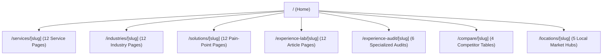

# BISHORGO EXPERIENCE — We Build Experiences People Remember.

<p align="center">
  
</p>

---

## ✦ The Belief & Philosophy

Bishorgo is not a traditional marketing or branding agency. We do not treat strategy, web development, content production, or real-world activations as isolated tasks. 

Instead, we connect every single customer touchpoint into one **unified experience system** that customers can remember. We competing on memory, not noise. 

> *“কাপড় তো সবাই বিক্রি করে। আমরা বিক্রি করতে চেয়েছিলাম উৎসবের আনন্দ আর আভিজাত্য।”*
> — **Bishorgo Memory Loop Design**

---

## 🎨 Design System & Visual Tokens

The user interface uses a theatrical, premium aesthetic combining deep, calming greens with vibrant metallic golds and warm ivory paper textures, accented by micro-animations and film grain overlays.

### 1. Typography Scale
We utilize a curated font stack loaded dynamically via Google Fonts variables:
- **Display Headings**: `Space Grotesk` (`var(--font-grotesk)`) — Bold, sharp, modern.
- **English Body Copy**: `Plus Jakarta Sans` (`var(--font-jakarta)`) — Highly readable sans-serif.
- **Bengali Typography**: `Anek Bangla` (`var(--font-anek)`) & `Hind Siliguri` (`var(--font-siliguri)`) — Harmonious bangla sizing matching english line-heights.

### 2. Harmonious Color Palette
- **Background (Dark Mode)**: `#014A36` (Deep Forest Green) & `#002B20` (Cinematic Green)
- **Background (Light Mode)**: `#F8F5EF` (Warm Ivory Paper Texture)
- **Accents**: `#C8922B` (Branding Metallic Gold) & `#A87318` (Dark Rich Gold)
- **Status Accents**: `#B94A48` (Crimson Leak red for Experience Gaps)

---

## ⚙️ Site Architecture & Routing Map

Bishorgo Experience has **113 fully interconnected static routes** pre-rendered at build-time for optimal page speeds and crawlability.



### Route Index Summary
- **`/services/*`**: Commercial capabilities (Brand Strategy, Website Experience, Event Activation, etc.).
- **`/industries/*`**: Target segment landing pages answering what customer behavior triggers exist (Restaurants, Clothing Stores, Startups).
- **`/solutions/*`**: Pain-point diagnostics matching search queries (Brand Not Memorable, Low Engagement).
- **`/experience-audit/*`**: Inbound lead capturing paths leading to interactive gap finder tools.
- **`/method/*` & `/frameworks/*`**: Bishorgo’s proprietary IP structures (Customer Memory Score, Gap Map).
- **`/case-studies/*`**: Screenplay-bound reimagined local business case studies.
- **`/resources/*` & `/tools/*`**: Interactive audits and downloadable checklist materials.

---

## 🚀 Optimization & Crawler Readiness

- **SEO/SXO Alternates**: Strict canonical tags are dynamically generated on all 113 routes to avoid duplicate indexing.
- **AEO / AI Search Schemas**: Dynamic `Organization`, `WebSite`, `Service`, and `FAQPage` JSON-LD schemas are injected directly to feed LLMs, chatbots, and generative crawlers.
- **Static Pre-rendering**: Builds down to 100% static HTML via Next.js Turbopack workers for instant page loads.

---

## 🛠️ Developer Setup

### Prerequisites
- Node.js (v18.x or later recommended)
- npm or yarn

### Getting Started

1. **Install Dependencies**:
   ```bash
   npm install
   ```

2. **Run Development Server**:
   ```bash
   npm run dev
   ```
   Open [http://localhost:3000](http://localhost:3000) with your browser.

3. **Verify Production Build**:
   ```bash
   npm run build
   ```
   This generates the static code distribution under the `.next/` directory and checks page compilation integrity.

---
<p align="center">
  <b>Bishorgo Experience</b> — <i>Crafting experiences. Creating memories.</i>
</p>
